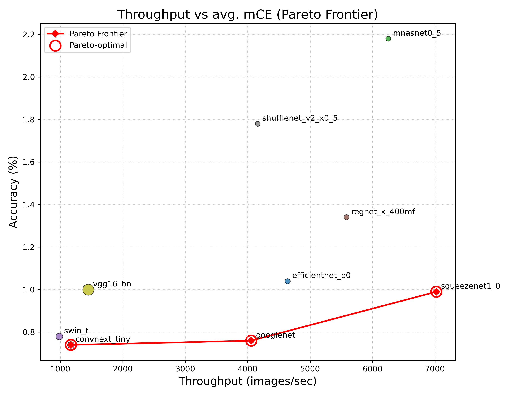
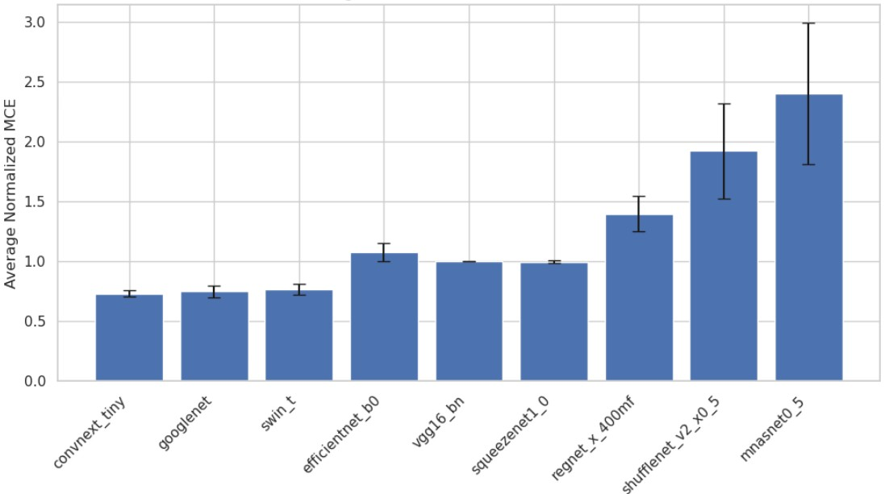
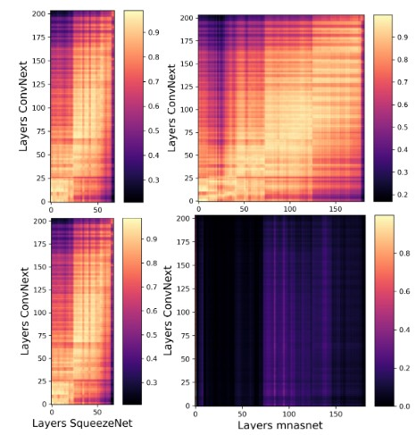

# uTHCD-C: A Benchmark for Robust and Efficient Tamil Handwritten Character Recognition

This repository contains the official code, corruption suite, evaluation pipelines, and pretrained models for:

> **uTHCD-C: A Benchmark for Robust and Efficient Tamil Handwritten Character Recognition**  
> _[anonymous — under review]_

uTHCD-C extends the original **uTHCD** handwritten character dataset with a standardized corruption suite covering **10 corruption types × 5 severity levels**, enabling systematic evaluation of:

- **Clean accuracy**  
- **Corruption robustness (mCE@top-k)**  
- **Robustness–efficiency trade-offs (Pareto frontiers)**  
- **Representation stability (t-SNE, CKA)**  

---

## 📁 Repository Structure

```
├── training_scripts/
├── eval_scripts/
├── images/
├── checkpoints/
└── README.md
```

---

## 📦 Dataset

### uTHCD Dataset (Original)
Download from the official source:

👉 *[[official download link](https://www.kaggle.com/datasets/faizalhajamohideen/uthcdtamil-handwritten-database)]*

* Extract 70:30 split from the above link
* Ensure the following directory structure
```
├── train/
├── val/
├── test/
```
* or, you can also directly download the dataset in a recommended format from [here](https://drive.proton.me/urls/WDV3MFBCBG#fhvtJlS97OK0)

### uTHCD-C (Corruption-Extended Benchmark)
Evaluate corruptions:

```
python eval_scripts/eval_corruptions.py --data_path /path/to/uthcd_test_folder
```
* It applies corruption to the test folder on the fly and saves the score in a JSON file
---

## 💾 Pretrained Checkpoints
Download pretrained weights:

👉 [pre-trained weights 1](https://drive.proton.me/urls/418VWPGC6R#s8GbS4hoyveU)
👉 [pre-trained weights 2](https://drive.proton.me/urls/X7E6CMCCMG#19Y6DDV9sH0i)

* After downloading and unzipping the folders above, move the pre-trained weights of convnext and swin-t from `[pre-trained weights 2]` to `[pre-trained weights 2]`.
* Path to loading a checkpoint for a model would be like `outputs/convnext_tiny/checkpoints/best.pt`


---
## ⚙️ Setting Up the Conda Environment

Follow the steps below to create and activate the Conda environment using the provided `environment.yml` file:

1. **Ensure Conda is installed**  
   Install [Miniconda](https://www.anaconda.com/docs/getting-started/miniconda/install) or [Anaconda](https://www.anaconda.com/download) if you don’t already have it.

2. **Create the environment from the YAML file**  
   ```bash
   conda env create -f environment.yml
3. **Activate the environment**
   ```
   conda activate thcr
---
## 🚀 Training

Example:

```
python training_scripts/convnext_train.py --data_path /path/to/uthcd_dataset --output_dir outputs/convnext_tiny
```

---

## 🧪 Robustness Evaluation

```
python eval_scripts/eval_corruptions.py --model convnext_tiny --checkpoint outputs/convnext_tiny/best.pt
```

---

## 🔍 Representation Similarity (CKA)
Example:
```
python eval_scripts/cka_convnext_squeezenet.py 
```

---

## 🖼️ Results

### Top-K Clean Accuracy


### Top-K Accuracy after adding Gaussian Noise


### Pareto-Optimal by avg mCE


### average mCE across top-k


### CKA between networks selected from Pareto models

---


